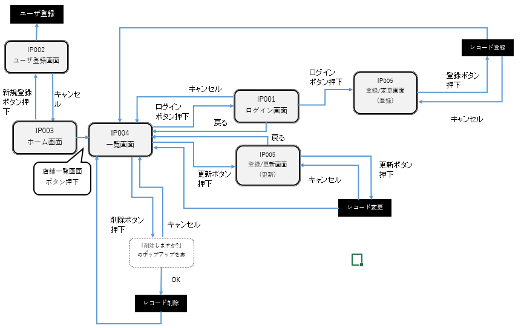
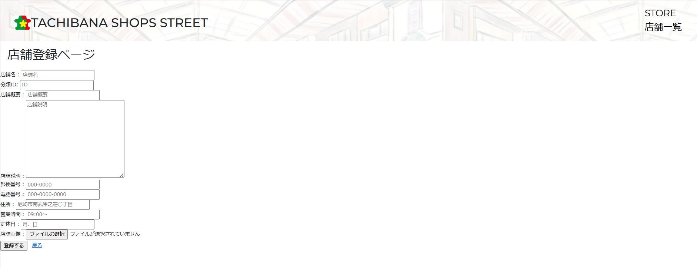
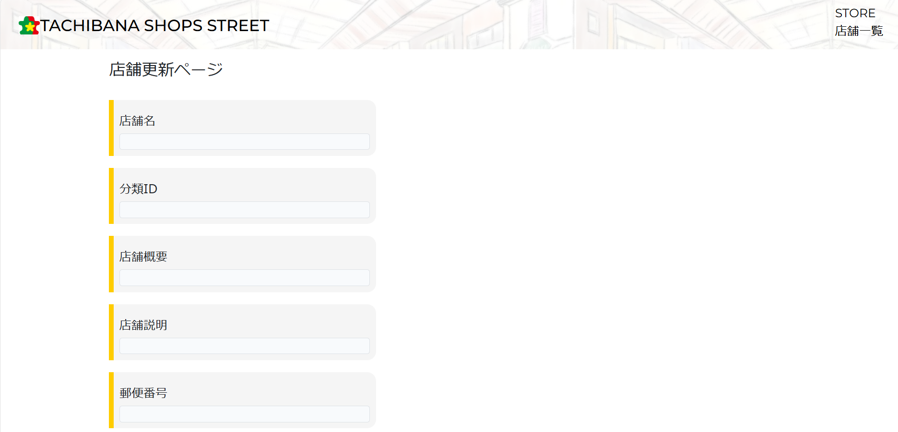
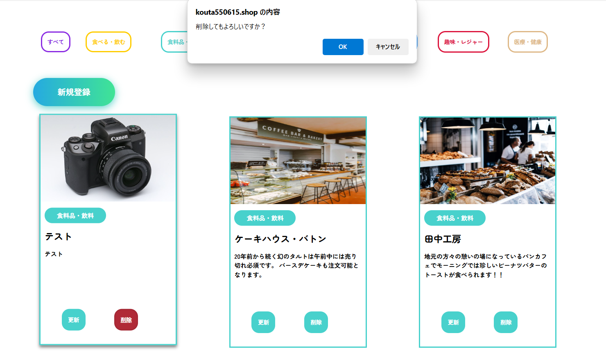

# アプリ概要 🚩

商店街サイトにて商店街内の店舗一覧を表示する並びに店舗登録・更新・削除するためのECサイトとなります。

公開URL：https://kouta550615.shop/

## アプリ概要 💻

### 特徴
。
店舗の分類ごとで商店街にある店舗一覧を確認することができます。各店舗ごとでクリックすると電話番号や定休日等店舗の情報を閲覧できます。

### 開発の背景

私が住んでいる家の近くには幼少期から存在する商店街がございます。そちらの商店街のサイトを確認すると店舗一覧画面が少し見づらく、店舗の更新機能が無さそうに見受けられました。

そこで、店舗一覧のレイアウトをもう少し見やすくしたい、店舗の管理を簡潔にできるようにしたいという想いからサイト開発しました。

### 主要機能概要

- 店舗新規登録: 店舗を新規で登録
- 店舗更新: 店舗情報を変更があった場合に更新することが可能
- 店舗削除: 店舗が閉店した際に店舗自体を一覧から削除することが可能
- 店舗一覧表示：店舗の分類ごとで店舗一覧を表示可能

## 技術・システム構成 ⚙️

- PHP 8.2.15
- MySQL 8.0.37
- Laravel 10.48.10
- Composer 2.7.6

インフラ:

- AWS(Cloud9)
- A5:SQL Mk-2 2.19.2.0
- XREA free

システムのインストール手順の詳細は以下を参照ください。

- [環境構築](Installation.md)

### テーブル定義

以下を参照ください。

- [テーブル定義](tables-definition.md)

### 画面遷移図

## 機能紹介

### 店舗一覧表示

商店街にある店舗一覧画面。店舗のカテゴリーごとで表示させることが可能。

### 店舗新規登録

店舗の登録画面。基本情報と合わせて、商店街サイトにログインしたユーザーのみ登録可能。

### 店舗更新

店舗の更新画面。店舗の基本情報の変更があった場合に更新可能。

### 店舗削除

不要な店舗を一覧から削除可能。

## 工夫した点 💡

### テーブル設計

もともとは店舗のカテゴリーごとでテーブルをそれぞれ分けておりました。
ですが、保守性が高くなるように以下２点を考えてました。
①shopliststocksテーブルという１つに統合
②カテゴリー情報が入っている別テーブル(shopcategorys)を用意

### レスポンシブ対応

## 今後の課題

- 更新・削除できるボタンを管理者のみ表示

  本アプリでは店舗更新/削除ができますが管理者・一般ユーザー関係なく残っています。それを解消するためにログインしたユーザのみ更新/削除ボタンが表示できるよう開発を進めます。

