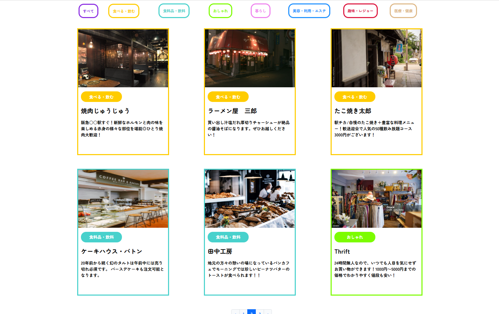

# Flagship 🚩

商店街サイトにて商店街内の店舗一覧を表示する並びに店舗登録・更新・削除するためのECサイトとなります。

公開URL：https://kouta550615.shop/

## アプリ概要 💻

### 特徴
。
店舗の分類ごとで商店街にある店舗一覧を確認することができます。各店舗ごとでクリックすると電話番号や定休日等店舗の情報を閲覧できます。

### 開発の背景

私が住んでいる家の近くには幼少期から存在する商店街がございます。そちらの商店街のサイトを確認すると店舗一覧画面が少し見づらく、店舗の更新機能が無さそうに見受けられました。

そこで、店舗一覧のレイアウトをもう少し見やすくしたい、店舗の管理を簡潔にできるようにしたいという想いからサイト開発しました。

### 主要機能概要

- 店舗新規登録: 店舗を新規で登録
- 店舗更新: 店舗情報を変更があった場合に更新することが可能
- 店舗削除: 店舗が閉店した際に店舗自体を一覧から削除することが可能
- 店舗一覧表示：店舗の分類ごとで店舗一覧を表示可能

## 技術・システム構成 ⚙️

- PHP 8.2.15
- MySQL 8.0.37
- Laravel 10.48.10
- Composer 2.7.6

インフラ:

- AWS(Cloud9)
- A5:SQL Mk-2 2.19.2.0
- XREA free

システムのインストール手順の詳細は以下を参照ください。

- [環境構築](Installation.md)

### テーブル定義

以下を参照ください。

- [テーブル定義](tables-definition.md)

### 画面遷移図

## 機能紹介

### 店舗一覧表示

商店街にある店舗一覧画面。店舗のカテゴリーごとで表示させることが可能。

### 店舗新規登録

取引先の登録画面。基本情報と合わせて、この取引先に所属する連絡先と配送住所を複数同時登録が可能。

### 店舗更新

受発注一覧画面。受注案件ごとの販売・仕入情報、粗利益を管理可能。

### 店舗削除

受発注一覧画面。受注案件ごとの販売・仕入情報、粗利益を管理可能。

## 工夫した点 💡

### テーブル設計

拡張性・保守性が高くなるように、テーブルの役割分担・正規化/非正規化を考えました。

### レスポンシブ対応

## 今後の課題

- 会計ソフトとのAPI連携

  本アプリで販売管理が可能になりましたが、まだ経理部門で会計ソフトへの二重入力や入金の消し込み作業を目視で行うなど非効率な部分が残っています。それを解消するために、API連携で請求先マスタの同期、目視照合作業の自動化の開発を進めます。

- 見積作成機能

  必要事項を入力すると雛形に合わせて見積書を自動で作成し、取引先・問合せ・受注マスタと紐づけた履歴管理をできるようにします。

